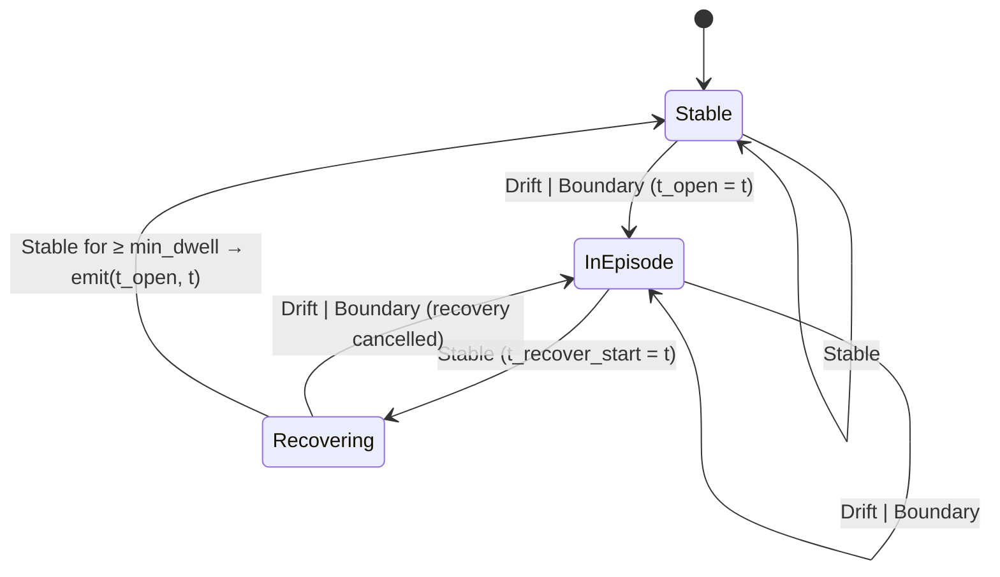

# Forensic API Report — `dsfb-database` 0.1.1

Source root: `.phase0/forensics/dsfb-database-0.1.1/` (extracted crates.io tarball, normalized `Cargo.toml`).
All citations are `file:line` against that root. Signatures are pasted verbatim from source. No docs.rs consulted.

---

## 1. Package facts

| Key | Value | Source |
|---|---|---|
| name | `dsfb-database` | `Cargo.toml:15` |
| version | `0.1.1` | `Cargo.toml:16` |
| edition | `2021` | `Cargo.toml:13` |
| rust-version (MSRV) | `1.74` | `Cargo.toml:14` |
| license | Apache-2.0 | `Cargo.toml:53` |
| lib | `name = "dsfb_database"`, `path = "src/lib.rs"` | `Cargo.toml:84-86` |
| `default-run` | `dsfb-database` (binary) | `Cargo.toml:37` |
| include (published files) | `src/**`, `spec/**`, `tests/**`, `examples/**`, `audit/**`, `colab/dsfb_database_repro.ipynb`, Cargo.toml, README, LICENSE, NOTICE, CITATION.cff | `Cargo.toml:19-31` — note: **no `paper/**`, no `benches/**`** in the published tarball |

### 1.1 Features (exact) — `Cargo.toml:56-82`

```toml
[features]
cli = ["dep:clap"]
default = ["cli"]
full = ["cli", "report", "otel", "live-postgres", "live-mysql"]
live-mysql = ["dep:mysql_async", "dep:tokio", "dep:futures-util", "report"]
live-postgres = ["dep:tokio", "dep:tokio-postgres", "dep:futures-util", "report"]
otel = ["dep:serde_json"]
report = ["dep:plotters", "dep:serde_json"]
```

Rationale comments in `Cargo.toml.orig:41-47, 52-74` (e.g. "library-mode consumers pay for core adapter + grammar + metrics + fingerprint machinery only"; `live-postgres` "Implies `report` because live mode emits episode CSVs and JSON sidecars"; `live-mysql` "the runtime connection wrapper is feature-gated because it pulls `mysql_async` and its async TLS dependency tree").

### 1.2 Dependencies — `Cargo.toml:264-341`

**Unconditional (compiled even with `default-features = false`):**

| crate | version | features / flags | actually used by |
|---|---|---|---|
| `anyhow` | `1` | — | everything (error plumbing) |
| `chrono` | `0.4` | `["clock"]`, `default-features = false` | only `adapters/snowset.rs:32,80-88` (timestamp parse) |
| `csv` | `1.3` | — | `adapters/*` loaders + `report` CSV writers |
| `dsfb` | `0.1.2` | — | `grammar/motifs.rs:19` (`DsfbObserver`, `DsfbParams`) |
| `rand` | `0.8` | — | `perturbation/mod.rs:21`, exemplar generators in adapters |
| `rand_pcg` | `0.3` | — | `perturbation/mod.rs:62` (`Pcg64::seed_from_u64`) |
| `serde` | `1` | `["derive"]` | all stream/grammar types |
| `serde_yaml` | `0.9` | — | only `grammar/mod.rs:183-185` (`MotifGrammar::from_yaml`) |
| `sha2` | `0.10` | — | fingerprints (`residual/mod.rs:152`, `grammar/replay.rs:9`, `live/tape.rs:35`) |
| `zip` | `0.6` | `default-features = false` | **only `src/main.rs:1333-1349`** (binary artifact bundle) |

**Optional (feature-gated):**

| crate | version | features | gated by |
|---|---|---|---|
| `clap` | `4` | `["derive"]` | `cli` |
| `futures-util` | `0.3` | — | `live-postgres`, `live-mysql` |
| `mysql_async` | `0.36` | `["default-rustls"]`, `default-features = false` | `live-mysql` |
| `plotters` | `0.3` | `["bitmap_backend","bitmap_encoder","line_series","ttf"]`, `default-features = false` | `report` |
| `serde_json` | `1` | — | `otel`, `report` |
| `tokio` | `1` | `["rt","time","macros","signal","sync"]` | `live-postgres`, `live-mysql` |
| `tokio-postgres` | `0.7` | — | `live-postgres` |

`Cargo.toml.orig:88-97` documents why `plotters` needs `ttf` (default font stub panics in plotters 0.3.7) and why `zip` uses `stored` mode with pinned metadata for byte-stable archives (`Cargo.toml.orig:99-105`).

**dev-dependencies** (`Cargo.toml:343-356`): `arbtest 0.3`, `criterion 0.5`, `loom 0.7`, `tempfile 3`, `trybuild 1`.

### 1.3 Targets

- 15 `[[bin]]` targets (`Cargo.toml:88-186`), all with `required-features`: `ablation_sweep`, `baseline_bake_off`, `baseline_tune` (cli+report+live-postgres), `bootstrap_coverage`, `dsfb-database` (cli+report), `ingest_throughput`, `inject_over_real`, `live_pulsed_scrape_figure` (cli+report+live-postgres), `null_trace`, `pr_sweep` (cli+report), `public_trace_bakeoff` (cli+report), `render_live_eval_figures` (cli+report+live-postgres), `replay_tape_baselines` (cli+report+live-postgres), `tpc_c_generalization`, `variance_sweep`.
- 1 example: `postgres_ingest` (`Cargo.toml:188-190`).
- 18 `[[test]]` targets (`Cargo.toml:192-262`).
- `Cargo.toml.orig:312-328` additionally declares 3 `[[bench]]` targets (`motif_engine`, `baselines`, `live_distiller`) — **not shipped** in the tarball.
- `[profile.release]`: `opt-level = 3`, `lto = "thin"` (`Cargo.toml:358-360`).

---

## 2. Public library surface

`src/lib.rs` opens with `#![forbid(unsafe_code)]` (`lib.rs:1`) and declares (`lib.rs:31-46`):

```rust
pub mod adapters;
pub mod baselines;
pub mod grammar;
#[cfg(feature = "live-postgres")]
pub mod live;
pub mod live_mysql;
pub mod metrics;
pub mod metrics_exporter;
pub mod non_claims;
pub mod perturbation;
pub mod report;
pub mod residual;
pub mod streaming;

pub use grammar::{Episode, MotifClass, MotifEngine, MotifGrammar};
pub use residual::{ResidualClass, ResidualSample, ResidualStream};

pub const CRATE_VERSION: &str = env!("CARGO_PKG_VERSION");   // lib.rs:50
```

Note the only root-level feature gate: **`live` requires `live-postgres`** (`lib.rs:34`). `live_mysql` is *always* compiled but only its `queries` submodule is (see §7).

### 2.1 `grammar` (module: `src/grammar/mod.rs`; submodules `envelope`, `motifs`, `replay`)

```rust
// grammar/mod.rs:27-34
#[derive(Debug, Clone, Copy, PartialEq, Eq, Hash, Serialize, Deserialize)]
pub enum MotifClass {
    PlanRegressionOnset,
    CardinalityMismatchRegime,
    ContentionRamp,
    CacheCollapse,
    WorkloadPhaseTransition,
}
impl MotifClass {
    pub const ALL: [MotifClass; 5];            // mod.rs:37-43
    pub fn name(&self) -> &'static str;        // mod.rs:45-53
    pub fn residual_class(&self) -> ResidualClass; // mod.rs:55-63
}

// grammar/mod.rs:68-82
#[derive(Debug, Clone, Serialize, Deserialize)]
pub struct Episode {
    pub motif: MotifClass,
    pub channel: Option<String>,
    pub t_start: f64,
    pub t_end: f64,
    pub peak: f64,              // peak |residual| inside episode
    pub ema_at_boundary: f64,   // EMA-smoothed residual at boundary
    pub trust_sum: f64,         // multi-channel trust weight sum (≈1.0)
}

// grammar/mod.rs:85-99
#[derive(Debug, Clone, Deserialize, Serialize)]
pub struct MotifParams {
    pub rho: f64,               // DSFB EMA smoothing
    pub sigma0: f64,            // DSFB trust softness
    pub drift_threshold: f64,   // |EMA residual| above → drift
    pub slew_threshold: f64,    // instantaneous |residual| above → boundary
    pub min_dwell_seconds: f64, // episodes shorter than this are discarded
}
impl MotifParams {
    pub fn default_for(class: MotifClass) -> Self;   // mod.rs:105-143
}

// grammar/mod.rs:147-170
#[derive(Debug, Clone, Serialize, Deserialize)]
pub struct MotifGrammar {
    pub plan_regression_onset: MotifParams,
    pub cardinality_mismatch_regime: MotifParams,
    pub contention_ramp: MotifParams,
    pub cache_collapse: MotifParams,
    pub workload_phase_transition: MotifParams,
}
impl MotifGrammar {
    pub fn params(&self, class: MotifClass) -> &MotifParams;   // mod.rs:173-181
    pub fn from_yaml(yaml: &str) -> anyhow::Result<Self>;      // mod.rs:183-185
}
// impl Default for MotifGrammar — mod.rs:156-170

// grammar/mod.rs:189-213
pub struct MotifEngine { grammar: MotifGrammar }
impl MotifEngine {
    pub fn new(grammar: MotifGrammar) -> Self;                       // mod.rs:194
    pub fn run(&self, stream: &ResidualStream) -> Vec<Episode>;      // mod.rs:200
    // run: per-class, per-channel, sorts all episodes by t_start
    // (partial_cmp unwrap_or(Equal)) — mod.rs:200-213
}
```

`envelope` (`grammar/envelope.rs:14-34`):

```rust
#[derive(Debug, Clone, Copy, PartialEq, Eq)]
pub enum Envelope { Stable, Drift, Boundary }

pub fn classify(ema: f64, instant: f64, drift_threshold: f64, slew_threshold: f64) -> Envelope
// |instant| >= slew_threshold          -> Boundary
// else |ema|    >= drift_threshold     -> Drift
// else                                  -> Stable
```

`replay` (`grammar/replay.rs:11-33`):

```rust
pub fn fingerprint(episodes: &[Episode]) -> [u8; 32];   // SHA-256 over motif(u8), channel, "|", t_start/t_end/peak/ema_at_boundary/trust_sum as to_le_bytes
pub fn fingerprint_hex(episodes: &[Episode]) -> String;
```

### 2.2 `residual` (`src/residual/mod.rs`; submodules `plan_regression`, `cardinality`, `contention`, `cache_io`, `workload_phase`)

```rust
// residual/mod.rs:24-36
#[derive(Debug, Clone, Copy, PartialEq, Eq, Hash, Serialize, Deserialize)]
pub enum ResidualClass {
    PlanRegression,   // latency vs rolling baseline; plan-hash transitions
    Cardinality,      // actual_rows / estimated_rows divergence
    Contention,       // lock-wait depth, blocked-by chain, queue depth
    CacheIo,          // buffer/cache hit-ratio drop with I/O-wait amplification
    WorkloadPhase,    // digest-mix entropy / class-distribution drift
}
impl ResidualClass {
    pub const ALL: [ResidualClass; 5];      // mod.rs:39-45
    pub fn name(&self) -> &'static str;     // mod.rs:47-55
}

// residual/mod.rs:61-72
#[derive(Debug, Clone, Serialize, Deserialize)]
pub struct ResidualSample {
    pub t: f64,               // logical time, seconds since stream start
    pub class: ResidualClass,
    pub value: f64,           // the residual; "Never NaN" (dropped at adapter boundary)
    pub channel: Option<String>,
}
impl ResidualSample {
    pub fn new(t: f64, class: ResidualClass, value: f64) -> Self;           // mod.rs:75-83
    pub fn with_channel(mut self, channel: impl Into<String>) -> Self;      // mod.rs:85-88
}

// residual/mod.rs:94-100
#[derive(Debug, Clone, Default, Serialize, Deserialize)]
pub struct ResidualStream {
    pub source: String,                 // dataset/engine/version label
    pub samples: Vec<ResidualSample>,   // "Adapters MUST sort" (t ascending)
}
impl ResidualStream {
    pub fn new(source: impl Into<String>) -> Self;                    // mod.rs:103-108
    pub fn push(&mut self, s: ResidualSample);                        // mod.rs:110-112
    pub fn sort(&mut self);                                           // mod.rs:114-122
    pub fn len(&self) -> usize;                                       // mod.rs:124-126
    pub fn is_empty(&self) -> bool;                                   // mod.rs:128-130
    pub fn duration(&self) -> f64;                                    // mod.rs:132-141
    pub fn iter_class(&self, class: ResidualClass)
        -> impl Iterator<Item = &ResidualSample> + '_;                // mod.rs:145-147
    pub fn fingerprint(&self) -> [u8; 32];                            // mod.rs:151-165
    // SHA-256 over source + per-sample t/class-as-u8/value to_le_bytes + channel + "|"
}
```

Residual-construction helpers (all `pub fn`, all take `&mut ResidualStream` first):

```rust
// plan_regression.rs:22-32  push_latency(stream, t: f64, qclass: &str, latency: f64, baseline: f64)
//   residual = (latency - baseline) / max(|baseline|, 1e-9)
// plan_regression.rs:37-42  push_plan_change(stream, t: f64, qclass: &str)  // value 1.0, channel "{qclass}#plan_change"
// cardinality.rs:23-34      push(stream, t: f64, qclass: &str, estimated_rows: f64, actual_rows: f64)
//   residual = log10(max(actual,1) / max(estimated,1))   // "q-error in log-space"
// contention.rs:13-17       push_wait(stream, t: f64, wait_event: &str, wait_seconds: f64)
// contention.rs:22-27       push_chain_depth(stream, t: f64, wait_event: &str, depth: usize)  // channel "{wait_event}#chain"
// cache_io.rs:17-26         push_hit_ratio(stream, t: f64, cache_id: &str, expected: f64, observed: f64)  // expected - observed
// cache_io.rs:28-43         push_io_amplification(stream, t: f64, file_id: &str, observed_seconds: f64, baseline_seconds: f64)  // obs/base - 1, 0 if base<=0
// workload_phase.rs:21-43   js_divergence(p: &HashMap<String,u64>, q: &HashMap<String,u64>) -> f64  // JS divergence, base-2, [0,1]
// workload_phase.rs:47-49   push_jsd(stream, t: f64, bucket_id: &str, jsd: f64)
```

### 2.3 `streaming` (`src/streaming.rs`)

```rust
pub const DEFAULT_REORDER_WINDOW_S: f64 = 10.0;      // streaming.rs:42
pub struct StreamingIngestor { /* stream, reorder_window_s, buf: BinaryHeap<Staged>, newest_t, dropped_out_of_window */ }  // L51-62
impl StreamingIngestor {
    pub fn new(source: impl Into<String>) -> Self;                              // L94
    pub fn with_window(source: impl Into<String>, reorder_window_s: f64) -> Self; // L101
    pub fn push(&mut self, sample: ResidualSample);                             // L120 (drops out-of-window, counted)
    fn drain_ready(&mut self);                                                  // L142 (private)
    pub fn finish(mut self) -> (ResidualStream, u64);                           // L156 (stream, dropped_count)
    pub fn flushed(&self) -> usize;                                             // L168
    pub fn staged(&self) -> usize;                                              // L173
    pub fn dropped_out_of_window(&self) -> u64;                                 // L180
}
```

Invariant (doc, `streaming.rs:48-50`): after every `push`/`finish` the owned stream is time-ordered.

### 2.4 `metrics` (`src/metrics.rs`)

```rust
#[derive(Debug, Clone, Serialize, Deserialize, Default)]
pub struct PerMotifMetrics { pub motif: String, pub tp: u64, pub fp: u64, pub fn_: u64,
    pub precision: f64, pub recall: f64, pub f1: f64,
    pub time_to_detection_median_s: f64, pub time_to_detection_p95_s: f64,
    pub false_alarm_rate_per_hour: f64, pub episode_compression_ratio: f64 }   // L15-33
pub fn evaluate(episodes: &[Episode], windows: &[PerturbationWindow],
    total_residual_samples_per_motif: &std::collections::HashMap<MotifClass, usize>,
    trace_duration_s: f64) -> Vec<PerMotifMetrics>;                            // L48-116
pub fn f1_delta(baseline: &[PerMotifMetrics], scaled: &[PerMotifMetrics]) -> Vec<(String, f64)>;  // L247-253
pub fn cross_signal_agreement(episodes: &[Episode]) -> Vec<(MotifClass, f64)>; // L271-305
pub fn stability_under_perturbation(stress_rows: &[(f64, String, f64)]) -> std::collections::HashMap<String, f64>; // L324-357
```

### 2.5 `metrics_exporter` (`src/metrics_exporter.rs`) — pure, no HTTP/async

```rust
#[derive(Debug, Clone, Default)]
pub struct MetricsSnapshot {
    pub per_motif_count: [u64; MotifClass::ALL.len()],
    pub per_motif_last_peak: [f64; MotifClass::ALL.len()],
    pub per_motif_last_trust_sum: [f64; MotifClass::ALL.len()],
    pub streaming_staged: u64, pub streaming_flushed: u64, pub streaming_dropped_out_of_window: u64,
}                                                                              // L44-59
impl MetricsSnapshot {
    pub fn from_episodes(episodes: &[Episode]) -> Self;                        // L65-80
    pub fn with_streaming(mut self, ing: &StreamingIngestor) -> Self;          // L85-90
}
pub fn render_openmetrics(snap: &MetricsSnapshot) -> String;                   // L107-200 (deterministic text, ends "# EOF\n")
```

### 2.6 `non_claims` (`src/non_claims.rs`)

```rust
pub const NON_CLAIMS: [&str; 7];   // L9-17 (pinned verbatim by tests/non_claim_lock.rs)
pub fn print();                    // L20-25
pub fn as_block() -> String;       // L29-35
```

### 2.7 `perturbation` (`src/perturbation/mod.rs`)

```rust
#[derive(Debug, Clone, Copy, PartialEq, Eq, Serialize, Deserialize)]
pub enum PerturbationClass { LatencyInjection, StatisticsStaleness, LockHold, CacheEviction, WorkloadShift }  // L24-31
#[derive(Debug, Clone, Serialize, Deserialize)]
pub struct PerturbationWindow { pub class: PerturbationClass, pub t_start: f64, pub t_end: f64,
    pub channel: String, pub magnitude: f64, pub seed: u64 }                  // L33-41
pub fn tpcds_with_perturbations(seed: u64) -> (ResidualStream, Vec<PerturbationWindow>);              // L46-48
pub fn tpcds_with_perturbations_scaled(seed: u64, scale: f64) -> (ResidualStream, Vec<PerturbationWindow>); // L58-189
```

### 2.8 `baselines` (`src/baselines/mod.rs`; submodules `adwin`, `bocpd`, `pelt`)

```rust
pub trait ChangePointDetector {
    fn name(&self) -> &'static str;
    fn detect(&self, series: &[(f64, f64)]) -> Vec<f64>;      // L51-55
}
pub fn run_detector(detector: &dyn ChangePointDetector, motif: MotifClass, stream: &ResidualStream) -> Vec<Episode>; // L66-103
```

### 2.9 `adapters` (`src/adapters/mod.rs`; submodules `ceb`, `generic_csv`, `job`, `otel` (feature `otel`), `postgres`, `snowset`, `sqlshare`, `sqlshare_text`, `tpcds`)

```rust
pub trait DatasetAdapter {
    fn name(&self) -> &'static str;
    fn load(&self, path: &std::path::Path) -> Result<ResidualStream>;   // anyhow::Result
    fn exemplar(&self, seed: u64) -> ResidualStream;                    // source = "{name}-exemplar-seed{seed}"
}                                                                       // adapters/mod.rs:39-52
pub fn load_pg_stat_statements(path: &Path) -> Result<ResidualStream>;  // postgres.rs:91-130
pub struct GenericCsvOptions { pub time_col: Option<String>, pub value_col: Option<String>,
    pub channel_col: Option<String>, pub pre_residualized: bool }       // generic_csv.rs:66-72
pub fn load_generic_csv(path: &Path, opts: &GenericCsvOptions) -> Result<ResidualStream>;  // generic_csv.rs:79-190
```

### 2.10 `live` — **only with feature `live-postgres`** (`src/live/mod.rs:61-72`)

```rust
pub mod distiller; pub mod emitter; pub mod queries; pub mod readonly_conn; pub mod scraper; pub mod tape;
pub use distiller::{DistillerState, Snapshot};
pub use emitter::LiveEmitter;
pub use queries::AllowedQuery;
pub use readonly_conn::ReadOnlyPgConn;
pub use scraper::{BackpressureState, Budget, Scraper};
pub use tape::{Tape, TapeManifest};
```

Key signatures (see §3, §5 for the state machinery and §7 for the flow):

```rust
// distiller.rs:51-57
#[derive(Debug, Clone, Default)]
pub struct Snapshot { pub t: f64, pub pgss: Vec<PgssRow>, pub activity: Vec<ActivityRow>,
    pub stat_io: Vec<StatIoRow>, pub stat_database: Vec<StatDatabaseRow> }
// distiller.rs:60-88: PgssRow { query_id: String, calls: u64, total_exec_time_ms: f64 }
//                     ActivityRow { wait_event_type, wait_event, state: String }
//                     StatIoRow { backend_type, object, context: String, reads: u64, hits: u64, read_time_ms: f64 }
//                     StatDatabaseRow { datname: String, blks_hit: u64, blks_read: u64 }
pub const BASELINE_WINDOW: usize = 3;                       // distiller.rs:94
pub struct PgssQidState { /* private */ }                   // distiller.rs:100-106
impl PgssQidState {
    pub fn push_snapshot(&mut self, calls: u64, total_exec_ms: f64) -> Option<(f64, f64)>; // distiller.rs:118-151 (mean, baseline)
}
pub struct DistillerState { /* private fields */ }          // distiller.rs:173-180
impl DistillerState {
    pub fn new() -> Self;                                   // distiller.rs:183
    pub fn ingest(&mut self, snap: &Snapshot) -> Vec<ResidualSample>;  // distiller.rs:200-209
}
// emitter.rs:39-45
pub struct LiveEmitter { /* buffer: ResidualStream, engine: MotifEngine, emitted: HashSet<EpisodeKey>,
                            retention_window_s: f64, max_samples: usize */ }
impl LiveEmitter {
    pub fn new(grammar: MotifGrammar, retention_window_s: f64, max_samples: usize) -> Self;  // emitter.rs:50
    pub fn push_samples(&mut self, samples: Vec<ResidualSample>) -> Vec<Episode>;            // emitter.rs:62 (rescan + dedup)
    pub fn buffer_len(&self) -> usize;                                                       // emitter.rs:112
    pub fn emitted_count(&self) -> usize;                                                    // emitter.rs:119
}
// queries.rs:19-38 — closed enum, 4 variants
pub enum AllowedQuery { PgStatStatementsSnapshot, PgStatActivitySnapshot, PgStatIoSnapshot, PgStatDatabaseSnapshot }
impl AllowedQuery {
    pub const ALL: [AllowedQuery; 4];                    // queries.rs:44-49
    pub fn sql(&self) -> &'static str;                   // queries.rs:54-111 (pure SELECTs)
    pub fn sql_concat_for_lock() -> String;              // queries.rs:116-125
}
// readonly_conn.rs:33-35
pub struct ReadOnlyPgConn { client: tokio_postgres::Client }  // client is PRIVATE
impl ReadOnlyPgConn {
    pub async fn connect(conn_str: &str) -> Result<Self>;                      // readonly_conn.rs:45-73 (sets + verifies read-only)
    pub async fn query_allowed(&self, q: AllowedQuery) -> Result<Vec<tokio_postgres::Row>>; // readonly_conn.rs:79-85
}
// scraper.rs:33-41
pub struct Budget { pub max_poll_ms: u64, pub cpu_pct: f64 }   // Default: 500ms, 0.1 — L43-50
pub struct BackpressureState { /* private */ }                 // scraper.rs:65-73
impl BackpressureState {
    pub fn new(interval: Duration, budget: Budget) -> Self;    // scraper.rs:76
    pub fn record_and_plan(&mut self, wall: Duration, self_time: Duration,
        interval_since_last: Duration) -> PollReport;          // scraper.rs:88-122
    pub fn current_sleep(&self) -> Duration;                   // scraper.rs:124
    pub fn nominal_interval(&self) -> Duration;                // scraper.rs:128
}
pub struct PollReport { pub t_wall_start: f64, pub snapshot_duration_ms: u64,
    pub cpu_pct_rolling: f64, pub throttle_factor: f64 }       // scraper.rs:135-140
pub struct Scraper { /* private */ }                           // scraper.rs:144-153
impl Scraper {
    pub fn new(conn: ReadOnlyPgConn, interval: Duration, budget: Budget) -> Self;  // scraper.rs:156
    pub async fn next_snapshot(&mut self) -> Result<(Snapshot, Duration)>;         // scraper.rs:173-200
    pub fn record_and_plan(&mut self, wall: Duration, self_time: Duration,
        interval_since_last: Duration) -> PollReport;          // scraper.rs:205-239
    pub fn next_sleep(&self) -> Duration; pub fn nominal_interval(&self) -> Duration; // scraper.rs:242-248
}
// tape.rs — see §5
```

### 2.11 `live_mysql` (`src/live_mysql/mod.rs:43-51`) — **always compiled**, but:

```rust
pub mod queries;                                    // always (allow-list enum only; no deps)
#[cfg(feature = "live-mysql")]
pub mod readonly_conn;
pub use queries::AllowedMySqlQuery;                 // always
#[cfg(feature = "live-mysql")]
pub use readonly_conn::ReadOnlyMySqlConn;
```

`AllowedMySqlQuery { DigestSnapshot, ThreadsSnapshot, MetadataLocksSnapshot, BufferPoolSnapshot }` with `ALL`, `sql()`, `sql_concat_for_lock()` (`live_mysql/queries.rs:27-58`). The doc (`live_mysql/mod.rs:30-41`) states a full scraper/distiller is explicitly *future work* — only the three-layer read-only contract ships.

### 2.12 `report` (`src/report/mod.rs`)

```rust
#[cfg(feature = "report")] pub mod plots;      // mod.rs:9-10 (plotters)
#[cfg(feature = "report")] pub mod plots_live; // mod.rs:11-12
#[derive(Debug, Serialize)] pub struct ReportHeader { pub crate_version: &'static str, pub generated_at: String,
    pub non_claims: [&'static str; 6], pub source: String }   // mod.rs:25-31
pub fn write_episodes_csv(path: &Path, episodes: &[Episode]) -> Result<()>;   // mod.rs:33-60
pub fn write_metrics_csv(path: &Path, metrics: &[PerMotifMetrics]) -> Result<()>; // mod.rs:62-97
#[cfg(feature = "report")] pub fn write_json<T: Serialize + ?Sized>(path: &Path, value: &T) -> Result<()>; // mod.rs:103-113
pub fn write_provenance(path: &Path, source: &str) -> Result<()>;             // mod.rs:116-128
```

---

## 3. The regime/episode machinery (the architectural lesson for frf-fuzz)

### 3.1 The two residual signals

- **Instantaneous residual** = the raw sample `r_k` = `ResidualSample.value` (`residual/mod.rs:68`).
- **Smoothed residual (EMA)** = `s_k = ρ·s_{k−1} + (1−ρ)·|r_k|` — an EMA of the **absolute** residual, computed inside `dsfb`'s trust module (`dsfb-0.1.2/src/trust.rs:33`: `ema_residuals[k] = rho * ema_residuals[k] + (1.0 - rho) * residuals[k].abs();`) and read back by the motif loop via `obs.ema_residual(0)` (`grammar/motifs.rs:183`).
- The envelope `classify(ema, instant, drift_threshold, slew_threshold)` (`grammar/envelope.rs:24-34`):
  1. `|instant| ≥ slew_threshold` → `Boundary`
  2. else `|ema| ≥ drift_threshold` → `Drift`
  3. else → `Stable`

### 3.2 The DSFB observer contract (dsfb 0.1.2, registry source)

```rust
// dsfb-0.1.2/src/params.rs:12-19
pub struct DsfbParams { pub k_phi: f64, pub k_omega: f64, pub k_alpha: f64, pub rho: f64, pub sigma0: f64 }
impl DsfbParams {
    pub fn new(k_phi: f64, k_omega: f64, k_alpha: f64, rho: f64, sigma0: f64) -> Self;
    pub fn default_params() -> Self;   // 0.5, 0.1, 0.01, 0.95, 0.1
}
// dsfb-0.1.2/src/observer.rs
pub struct DsfbObserver { /* private */ }
impl DsfbObserver {
    pub fn new(params: DsfbParams, channels: usize) -> Self;
    pub fn init(&mut self, initial_state: DsfbState);
    pub fn step(&mut self, measurements: &[f64], dt: f64) -> DsfbState;  // predict→residual→trust-weights→correct
    pub fn state(&self) -> DsfbState;
    pub fn trust_stats(&self) -> &[TrustStats];
    pub fn trust_weight(&self, channel: usize) -> f64;
    pub fn ema_residual(&self, channel: usize) -> f64;
}
```

Per-motif invocation (`grammar/motifs.rs:22-35`): `DsfbParams::new(DEFAULT_K_PHI=0.5, DEFAULT_K_OMEGA=0.1, DEFAULT_K_ALPHA=0.01, params.rho, params.sigma0)`; one single-channel observer per (motif, channel) group plus one multi-channel observer across channels whose trust weights sum to ≈1.0 (`trust_sum_across`, `motifs.rs:263-267`; invariant test `test_trust_sum_invariant` referenced at `motifs.rs:14`).

**Sample-rate invariance**: `dt = (s.t - ctx.last_t).clamp(1e-6, 1.0)` (`motifs.rs:177`) — samples spaced >1 s are treated as 1 s apart so the dsfb predict step (`phi_pred = phi + omega·dt`, `observer.rs:25`) cannot run away on sparse telemetry. The comment at `motifs.rs:154-161` explains this is deliberate.

### 3.3 The state machine — exact transitions

Private per-channel state (`grammar/motifs.rs:269-274`):

```rust
enum MotifState {
    Stable,
    InEpisode { t_open: f64 },
    Recovering { t_open: f64, t_recover_start: f64 },
}
```

`advance` (`motifs.rs:277-315`), one call per sample, inputs `(self, env, t, min_dwell, emit, episode_t_start)`:

| current state | envelope | action |
|---|---|---|
| `Stable` | `Stable` | stay `Stable` |
| `Stable` | `Drift \| Boundary` | `*episode_t_start = t`; → `InEpisode { t_open: t }` |
| `InEpisode{t_open}` | `Stable` | → `Recovering { t_open, t_recover_start: t }` |
| `InEpisode{t_open}` | `Drift \| Boundary` | stay `InEpisode { t_open }` |
| `Recovering{t_open, t_recover_start}` | `Stable` | if `t - t_recover_start >= min_dwell`: `emit(t_open, t)`; → `Stable` — else stay `Recovering` |
| `Recovering{t_open, ..}` | `Drift \| Boundary` | → `InEpisode { t_open }` (re-drift cancels recovery) |



**Deterministic episode close** has two paths:
1. **In-stream close**: episode emits at the first `Stable` sample where `t - t_recover_start ≥ min_dwell_seconds`; the emitted window is `[t_open, t]` (`motifs.rs:303-305`).
2. **End-of-stream flush**: if the trace ends while `InEpisode`/`Recovering`, `flush_open_episode` closes at the last sample's `t` **iff** `last_t - t_open ≥ min_dwell_seconds`, else the open episode is discarded as a blip (`motifs.rs:224-258`).

Episode content at close (`step_sample`, `motifs.rs:196-216`): `peak = max|value|` over the episode; `ema_at_boundary = ctx.last_ema`; `trust_sum = Σ trust_weight(i)` across channels; `channel = Some(channel)`.

**Dwell semantics**: `min_dwell_seconds` acts as debounce both for close (recovery must hold) and for the flush guard. Per-class defaults (`grammar/mod.rs:105-143`, mirrored in `spec/motifs.yaml:11-44`): PlanRegression `{rho:0.9, sigma0:0.05, drift:0.20, slew:0.50, dwell:5.0}`; Cardinality `{0.9, 0.05, 0.50, 1.00, 2.0}`; Contention `{0.85, 0.01, 0.05, 0.50, 1.0}`; CacheCollapse `{0.9, 0.02, 0.10, 0.30, 5.0}`; WorkloadPhase `{0.9, 0.02, 0.15, 0.35, 30.0}`.

### 3.4 How frf-fuzz should implement its own generic `RegimeObserver`

The state machine needs **none** of the dsfb predict/correct machinery — the motif loop only reads `ema_residual(0)` (one line of EMA) and `trust_weight` (audit only). The phi/omega/alpha state and trust-adaptive fusion are unused for transition decisions. A generic, dependency-free reimplementation:

1. **State**: `Stable | InEpisode{t_open} | Recovering{t_open, t_recover_start}` — clone the enum (rename freely).
2. **EMA**: `ema = rho*ema + (1-rho)*|r|` per channel, initialized 0.0. This is the entire "smoothed residual".
3. **Envelope**: `classify(ema, r, drift_threshold, slew_threshold)` exactly as `envelope.rs:24-34` (Boundary check first).
4. **Transitions**: exactly the table in §3.3; `dt` clamp `[1e-6, 1.0]` only matters if you keep the dsfb predict — a plain EMA observer does not need `dt` at all (the crate clamps `dt` precisely to neuter the predict step).
5. **Determinism details to copy**:
   - group samples by channel with `BTreeMap<String, Vec<&Sample>>` (channel fallback `"_anonymous_"`, `motifs.rs:75-89`); anonymous channel fallback in the crate is `"_anonymous_"` (`motifs.rs:81`), generic CSV adapter uses `"generic"` (`generic_csv.rs:139`).
   - iterate channels in sorted key order; samples pre-sorted by `t` (`ResidualStream::sort`, `residual/mod.rs:114-122`).
   - sort emitted episodes by `t_start` with `partial_cmp(...).unwrap_or(Ordering::Equal)` (`grammar/mod.rs:207-211`).
   - never read a wall clock inside the observer; `t` is caller-supplied logical time.
6. **Drop `trust_sum`** unless you keep a multi-channel fusion; keep `peak` and `ema_at_boundary` for episode traceability.
7. **Dwell guard on flush**: reimplement `flush_open_episode` (`motifs.rs:224-258`) or episodes spanning the trace boundary are lost / spuriously short.
8. Output `Episode { motif: RegimeClass, channel: Option<String>, t_start, t_end, peak, ema_at_boundary }` — the exact field set with `motif` replaced by your generic regime class.

---

## 4. `ResidualClass` / `MotifEngine`: what the grammar admits; the SQL-specificity statements

### 4.1 Definitions

`ResidualClass` is a **closed enum of exactly five SQL-engine residual families**, each documented with its engine surface (`residual/mod.rs:24-36`): `PlanRegression` ("Latency vs rolling baseline; plan-hash transitions"), `Cardinality` ("`actual_rows / estimated_rows` divergence per plan node or per query"), `Contention` ("Lock-wait depth, blocked-by chain length, queue depth"), `CacheIo` ("Buffer / cache hit-ratio drop with I/O-wait amplification"), `WorkloadPhase` ("Digest-mix entropy and class-distribution drift across query workload"). Names "match Section 3 (Residual Taxonomy) of the paper" (`residual/mod.rs:21-23`).

`MotifClass` maps 1:1 onto it: `residual_class()` (`grammar/mod.rs:55-63`) and per-motif `MotifParams` thresholds tuned per class (`grammar/mod.rs:105-143`, `spec/motifs.yaml`).

**What the grammar admits**: a `ResidualStream` of `ResidualSample`s, each with a `value: f64` and one of those 5 classes; `MotifEngine::run` (`grammar/mod.rs:200-213`) filters `iter_class`, groups by channel, runs one 3-state machine per (class, channel), and returns `Vec<Episode>` sorted by `t_start`. There is no other input. A sample *must* carry a `ResidualClass` — there is no "generic" or "other" variant. Construction helpers exist only for the SQL semantics (`push_latency`, `push_plan_change`, `push(est,act)`, `push_wait`, `push_chain_depth`, `push_hit_ratio`, `push_io_amplification`, `push_jsd`, §2.2).

### 4.2 Explicit "not a universal grammar" statements (pinned)

- `non_claims.rs:14` (non-claim #5): *"DSFB-Database does not claim a universal SQL grammar; motifs are engine-aware, telemetry-aware, and workload-aware."*
- `non_claims.rs:15` (non-claim #6): *"DSFB-Database does not validate that an operator-supplied grammar is appropriate for a non-SQL residual stream; the generic CSV adapter is a worked example, not a universality claim."*
- `adapters/generic_csv.rs:13-21`: "It does **not** validate that the operator-supplied grammar is appropriate for the input signal, nor does it claim the five-motif vocabulary has any universal meaning outside SQL telemetry. This adapter is a **worked example**…"
- `main.rs:105-110` (`Generic` subcommand doc): "This is a worked example, not a universality claim — the operator is responsible for confirming the grammar is appropriate for the input signal."
- Pinned byte-for-byte by `tests/non_claim_lock.rs:14-42` (and against the paper when present, `non_claim_lock.rs:59-134`); over-claim tripwire in `tests/forbidden_phrases.rs`.
- `lib.rs:24-29` ("What this crate is NOT"): "It does **not** optimise queries, replace the optimiser, modify execution plans, change DBMS behaviour, or claim causal correctness."

### 4.3 Type-level honesty precedents worth copying (see §9)

- `ReadOnlyPgConn` hides its `tokio_postgres::Client` behind a private field, no `Deref`/`AsRef`/getter (`readonly_conn.rs:33-35, 88-91`) — write paths are unrepresentable.
- `AllowedQuery` closed enum; `sql()` returns `'static` strings; SHA-256 lock test (`queries.rs:19-38, 116-125`; `tests/live_query_allowlist_lock.rs`).
- Distiller **refuses** to fabricate a class: PostgreSQL exposes no cardinality signal, so `DistillerState` never emits `ResidualClass::Cardinality` (`distiller.rs:12-28` — "the live adapter **cannot** construct a cardinality residual").

---

## 5. Tapes: deterministic recording/replay machinery

Two layers:

### 5.1 `grammar/replay.rs` — episode fingerprint (no I/O, always available)

```rust
pub fn fingerprint(episodes: &[Episode]) -> [u8; 32];   // SHA-256 over, per episode:
    // motif as u8 (LE), channel bytes, b"|", t_start/t_end/peak/ema_at_boundary/trust_sum as to_le_bytes  (replay.rs:11-26)
pub fn fingerprint_hex(episodes: &[Episode]) -> String; // replay.rs:28-33
```

### 5.2 `live/tape.rs` — JSONL residual tape + SHA-256 sidecar (**only under feature `live-postgres`**)

```rust
#[derive(Debug, Clone, Serialize, Deserialize)]
pub struct TapeManifest {
    pub sha256: String,          // lowercase hex of tape bytes
    pub sample_count: u64,
    pub first_t: Option<f64>,
    pub last_t: Option<f64>,
    pub crate_version: String,   // CRATE_VERSION at finalize time
    pub source: String,
}                                                                 // tape.rs:41-55

pub struct Tape { /* path, BufWriter<File>, sample_count, first_t, last_t, source */ }  // tape.rs:58-65
impl Tape {
    pub fn create(path: &Path, source: impl Into<String>) -> Result<Self>;   // tape.rs:70-85 (truncate)
    pub fn append(&mut self, samples: &[ResidualSample]) -> Result<()>;      // tape.rs:88-103 (one JSON line per sample)
    pub fn finalize(mut self) -> Result<TapeManifest>;                       // tape.rs:107-140
    // flush → fsync → re-read bytes → SHA-256 → write "<tape>.hash" pretty-JSON manifest
}
pub fn manifest_path_for(tape: &Path) -> PathBuf;                            // tape.rs:144-148 ("<tape>.hash")
pub fn load_and_verify(path: &Path) -> Result<(ResidualStream, TapeManifest)>; // tape.rs:154-196
// refuses on: hash mismatch, missing manifest, non-UTF-8, sample-count mismatch; re-sorts stream
```

### 5.3 The deterministic contract (explicit, repeated)

- **tape → episodes is byte-stable; engine → tape is not.** Doc in `tape.rs:10-17`: "The seventh non-claim is explicit about the direction of the determinism guarantee: **tape → episodes is byte-stable; engine → tape is not.**" Same asymmetry in `live/mod.rs:12-23` and non-claim #7 (`non_claims.rs:16`).
- Locked by `tests/live_tape_replay_is_deterministic.rs:55-89` (two independent `load_and_verify` of one tape → equal stream + episode fingerprints; two tapes written from the same seed → identical manifest SHA-256) and `tests/deterministic_replay.rs:15-101` (pinned stream/episode SHA-256 hex values, e.g. `c1b64dac…72a` at `deterministic_replay.rs:63`).
- `Tape::finalize` fsyncs before hashing so a crash cannot yield a manifest pointing at partial bytes (`tape.rs:107-119`).
- Determinism posture: `ResidualStream::sort` by `t`; `fingerprint` hashes `f64::to_le_bytes` — byte-identical across runs/machines "modulo IEEE-754 rounding parity, which we do not perturb" (`tests/deterministic_replay.rs:1-8`).

**frf-fuzz RunTape takeaway**: this exact JSONL+sidecar-hash+verify-on-load design is ~150 lines of std+serde_json+sha2. The crate couples it to the `live-postgres` feature (see §6), so frf-fuzz should implement `RunTape` in its own tree rather than importing `dsfb_database::live::tape`.

---

## 6. Features — exact names, gating, and the pure-lib minimal build

### 6.1 Feature names (exact)

`default` (= `["cli"]`), `cli`, `report`, `otel`, `live-postgres`, `live-mysql`, `full` (`Cargo.toml:56-82`).

### 6.2 Can `default-features = false` avoid CLI/report/live deps? **Yes.**

Every heavyweight dep is `optional = true` and wired through features:
- `clap` ← `cli` only.
- `plotters`, `serde_json` ← `report` only; `serde_json` ← `otel` only.
- `tokio`, `tokio-postgres`, `futures-util` ← `live-postgres` / `live-mysql` only.
- `mysql_async` (rustls tree) ← `live-mysql` only.

With `default-features = false` the compiled dependency set is exactly: `anyhow`, `chrono` (clock), `csv`, `dsfb` (→ `rand`, `rand_distr`), `rand`, `rand_pcg`, `serde` (derive), `serde_yaml`, `sha2`, `zip` (stored-mode, no compression backends). No tokio, no postgres drivers, no plotters/font-kit, no serde_json, no mysql.

**GOTCHAs for "pure-lib minimal":**
- `zip` is compiled unconditionally but used **only** by the `dsfb-database` binary's `reproduce-all` path (`main.rs:1333-1349`); `chrono` only by the Snowset adapter (`adapters/snowset.rs:80-88`); `serde_yaml` only by `MotifGrammar::from_yaml`. They still enter the dependency graph of any consumer.
- `rand` + `rand_pcg` are unconditional because the perturbation harness and exemplar generators live in the lib (`perturbation/mod.rs:62`, adapters). A consumer using only the grammar still compiles them.
- `dsfb` 0.1.2 itself has no features and pulls `rand` + `rand_distr` (see `dsfb-0.1.2/Cargo.toml`).
- **The `live` module — and therefore `Tape` — is unreachable without `live-postgres`**, which drags tokio + tokio-postgres + futures-util + report. There is no "tape-only" feature.

### 6.3 Module-level `cfg` gates (complete list, from source grep)

| gate | item |
|---|---|
| `cfg(feature = "live-postgres")` | `pub mod live` (`lib.rs:34`); `Cmd::Live`/`Cmd::ReplayTape` + `run_live`/`live_loop_async`/`run_replay_tape`/`PERMISSIONS_MANIFEST` (`main.rs:133-179, 226-254, 1382-1554`); tests `live_*` (e.g. `tests/live_tape_replay_is_deterministic.rs:12`) |
| `cfg(feature = "otel")` | `pub mod otel` (`adapters/mod.rs:30-31`) |
| `cfg(feature = "live-mysql")` | `pub mod readonly_conn` + re-export (`live_mysql/mod.rs:45-51`) |
| `cfg(feature = "report")` | `report::plots`, `report::plots_live`, `report::write_json` (`report/mod.rs:9-12, 103-113`) |
| — (always) | everything else, including `live_mysql::queries` (the `AllowedMySqlQuery` enum "lives in library mode", `Cargo.toml.orig:70-72`) |

---

## 7. Streaming vs live vs adapters

| concept | module | needs a DB? | available in pure lib (`default-features = false`)? |
|---|---|---|---|
| **batch construction** | `residual::ResidualStream::push` + `sort` | no | yes |
| **streaming ingest** | `streaming::StreamingIngestor` (bounded reorder buffer, `DEFAULT_REORDER_WINDOW_S = 10.0`, drop counter) | no | yes — zero extra deps (`streaming.rs:42-183`) |
| **grammar core** | `grammar::{MotifEngine, MotifGrammar, MotifParams, Episode}`, `grammar::envelope`, `grammar::replay` | no | yes |
| **adapters** | `adapters::*` — file/dataset loaders, `DatasetAdapter` trait, `postgres` reads a CSV export (`postgres.rs:13-53`); `generic_csv` is the non-SQL worked example; `otel` reads a JSON file | **no** — all offline, none open sockets | yes (except `adapters::otel`) |
| **live PostgreSQL** | `live::*` — `ReadOnlyPgConn::connect` (requires tokio runtime + reachable server), `Scraper::next_snapshot` polls `pg_stat_*`, `DistillerState::ingest` counter→residual, `LiveEmitter` rescan, `Tape` | **yes** (`readonly_conn.rs:45-73`; panics without a tokio runtime, caller invariant per `readonly_conn.rs:40-44`) | **no** — behind `live-postgres` |
| **live MySQL** | `live_mysql` — only the read-only contract (enum + conn wrapper); scraper/distiller explicitly not shipped (`live_mysql/mod.rs:30-41`) | yes (with `live-mysql`) | only the `AllowedMySqlQuery` enum, no deps |

**Minimal residual-grammar core** = `residual` + `grammar` (+ `streaming`, `metrics_exporter`, `non_claims` if wanted). `perturbation`, `metrics`, `baselines`, `adapters`, `report` are evaluation/ingest extras; `live`/`live_mysql::readonly_conn` are DB-runtime extras.

---

## 8. Integration gotchas

1. **unsafe**: none — `#![forbid(unsafe_code)]` in both `lib.rs:1` and `main.rs:1`; grep of `src/` finds zero `unsafe`.
2. **global state**: none — no `static mut`, `OnceLock`, `lazy_static`, `thread_local`, `std::sync::Once` anywhere in `src/`. All observers are plain structs with interior state passed by `&mut`.
3. **wall clock**: only in the *binary* (`main.rs:571-581` throughput timing; `main.rs:1474-1529` live-loop tick timing) and in the live scraper's telemetry-of-the-telemetry row (`scraper.rs:175, 234` via `unix_epoch_seconds()`; `Instant::now()` at `scraper.rs:174, 198`). The grammar/stream/fingerprint/tape core never reads the clock — that is what makes tape→episodes byte-stable.
4. **floats**: `f64` everywhere; determinism hinges on `partial_cmp(...).unwrap_or(Ordering::Equal)` in every sort (`residual/mod.rs:115-121`, `grammar/mod.rs:207-211`, `adapters/postgres.rs:166-170`, `baselines/mod.rs:97-101`), `f64::to_le_bytes` in hashes, `debug_assert!` finiteness guards (`residual/mod.rs:76`, `motifs.rs:178-181`), NaN-dropping at adapter boundaries (`postgres.rs:141`, `generic_csv.rs:133`). IEEE-754 parity caveat stated at `tests/deterministic_replay.rs:5-7`. `EpisodeKey` discretises `t_start` to milliseconds for live dedup (`emitter.rs:33-37`) — defensive only.
5. **HashMap iteration order is neutralised explicitly** (e.g. `postgres.rs:188-191`: "HashMap iteration order is not" [deterministic]; keys collected then `.sort()`ed; `adapters/otel.rs:160-164` same pattern; `perturbation` builds streams by iterating RNG draws in fixed order). If frf-fuzz copies this code, preserve every sort.
6. **`dt` clamp** `[1e-6, 1.0]` (`motifs.rs:177`) — sparse samples must not feed the dsfb predict step.
7. **Heavyweight deps that must not leak into ordinary fuzzing**: `tokio`/`tokio-postgres`/`futures-util` (live-postgres), `mysql_async` + rustls (live-mysql), `plotters` + font-kit dylib surface (report; rationale at `Cargo.toml.orig:88-97`), `serde_json` (report/otel). All optional. Also note `dsfb` → `rand`/`rand_distr` and the unconditional `zip`/`chrono`/`serde_yaml` even when unused by a grammar-only consumer (§6.2).
8. **`live` module and `Tape` are unreachable without `live-postgres`** — the deterministic tape lesson cannot be imported cleanly; reimplement it locally (§5.3).
9. **`residual::ResidualStream::push` does not sort** — batch path requires an explicit `sort()` before `MotifEngine::run`, and the crate *relies* on adapters having sorted (`residual/mod.rs:98-99`).
10. **Fingerprint-pinned behavior**: changing residual serialisation, perturbation draws, or the state machine breaks pinned SHA-256s in tests (`deterministic_replay.rs:50-101`, `examples/postgres_ingest.rs:80-91`) and would break a forked consumer's replay locks.

---

## 9. Concrete recommendation for frf-fuzz

### 9.1 Minimal `dsfb-database` dependency for a real database telemetry target

```toml
[dependencies]
dsfb-database = { version = "0.1.1", default-features = false }   # zero optional features
# (optionally add features = ["report"] only if you want JSON sidecars/PNG;
#  add "live-postgres" ONLY for the live tokio+postgres adapter path)
```

With `default-features = false` you get: `ResidualClass`/`ResidualSample`/`ResidualStream`, the full `grammar` (MotifEngine/MotifGrammar/MotifParams/Episode/envelope/replay fingerprints), `streaming::StreamingIngestor`, all offline `adapters` (incl. `postgres::load_pg_stat_statements` CSV and `generic_csv::load_generic_csv`), `metrics`, `metrics_exporter`, `non_claims`, `perturbation`, `baselines`, and the CSV report writers. **No tokio/postgres/otel/plotters.**

### 9.2 Exact call sequence: feed residuals → get episodes

Batch (offline telemetry export — the recommended path):

```rust
use dsfb_database::adapters::postgres::load_pg_stat_statements;   // CSV from \copy, or:
// use dsfb_database::adapters::generic_csv::{load_generic_csv, GenericCsvOptions};
use dsfb_database::grammar::{replay, MotifEngine, MotifGrammar};
use dsfb_database::residual::{ResidualClass, ResidualSample, ResidualStream};

// (a) construct + sort the stream
let mut stream = load_pg_stat_statements(path)?;                  // adapter already sorts (postgres.rs:128)
// or manually:
let mut stream = ResidualStream::new("db-telemetry");
stream.push(ResidualSample::new(t, ResidualClass::PlanRegression, value).with_channel("qid"));
stream.push(ResidualSample::new(t, ResidualClass::WorkloadPhase, jsd).with_channel("bucket"));
stream.sort();                                                    // REQUIRED before run (residual/mod.rs:98-99)

// (b) grammar (defaults from spec/motifs.yaml; or MotifGrammar::from_yaml)
let engine = MotifEngine::new(MotifGrammar::default());
let episodes: Vec<Episode> = engine.run(&stream);                 // deterministic, sorted by t_start

// (c) determinism lock
let fp = replay::fingerprint_hex(&episodes);                      // grammar/replay.rs:28-33
```

Live (real engine, feature `live-postgres`):

```rust
use dsfb_database::live::*;
use dsfb_database::live::tape::{Tape, load_and_verify};
// tokio current-thread runtime REQUIRED (readonly_conn.rs:40-44)
let conn = ReadOnlyPgConn::connect(conn_str).await?;              // read-only enforced (readonly_conn.rs:45-73)
let mut scraper = Scraper::new(conn, Duration::from_secs(60), Budget::default());
let mut distiller = DistillerState::new();
let mut emitter = LiveEmitter::new(MotifGrammar::default(), 3600.0, 1_000_000);
let mut tape = Tape::create(&tape_path, "live-postgres:host=...")?;
loop {
    let (snap, wall) = scraper.next_snapshot().await?;
    let samples = distiller.ingest(&snap);                        // Vec<ResidualSample>
    tape.append(&samples)?;                                       // engine→tape (non-deterministic, honest)
    let fresh = emitter.push_samples(samples);                    // rescan; newly closed episodes
    // ... emit `fresh` ...
}
let manifest = tape.finalize()?;                                  // SHA-256 sidecar
let (replayed, m) = load_and_verify(&tape_path)?;                 // tape→episodes byte-stable
let eps = MotifEngine::new(MotifGrammar::default()).run(&replayed);
```

### 9.3 Structurally preventing generic fuzz residuals from becoming `ResidualClass`

Facts that make the refusal enforceable:

1. `ResidualClass` is a **closed enum** with exactly 5 SQL-specific variants and **no "generic"/"other" variant** (`residual/mod.rs:24-36`). Constructing a `ResidualSample` requires choosing one of those 5 — any generic fuzz residual would have to be *lied about* at the type level.
2. `MotifEngine::run` only consumes samples via `iter_class(class)` where `class ∈ MotifClass::ALL` mapping 1:1 onto the same 5 (`grammar/mod.rs:55-63, 200-213`). A `ResidualClass` value is the *only* admission ticket into the grammar.
3. The crate's own precedent: `ReadOnlyPgConn` makes writes **unrepresentable** by hiding the client (`readonly_conn.rs:33-35, 88-91`); the distiller refuses to fabricate the Cardinality class for PG (`distiller.rs:12-28`).

frf-fuzz implementation:

- **Never implement `From<GenericFuzzResidual> for ResidualClass`** (or `TryFrom`), and do not add a conversion trait that both sides can see. Put `dsfb-database` behind the optional `database` feature and give the generic fuzz core *no* dependency on it; the two types then cannot meet in generic code.
- In the `database` integration, construct `ResidualClass` **only** through the crate's SQL-semantics constructor functions (`plan_regression::push_latency`, `cardinality::push`, `contention::push_wait`, `cache_io::push_hit_ratio`, `workload_phase::push_jsd`, §2.2) or the typed adapter loaders — never from a bare `f64` + an arbitrary tag. Those functions are the type-level boundary: their arguments are (query class, latency, baseline), (estimated vs actual rows), etc., so a caller must already be speaking SQL telemetry.
- Optionally wrap: `struct TelemetryResidual(ResidualSample)` with constructor `fn from_engine_row(row: &PgssRow) -> Self` in the database crate only; generic fuzz code deals with its own `FuzzResidual` and its own generic `RegimeObserver` (the §3.4 reimplementation), which is generic over its own sample type and shares **no** code path with `ResidualClass`.
- Keep the enforcement testable exactly the way the crate does: a compile-fail / non-conversion lock (the crate's analogue: `tests/trybuild_readonly_conn/*.rs` fixtures + `tests/live_readonly_conn_surface.rs`, and `tests/non_claim_lock.rs` pinning the "worked example, not a universality claim" text).

---

## Appendix: determinism locks and honesty tests (evidence for §4-§5)

- `tests/deterministic_replay.rs:50-101` — pinned SHA-256s: stream `c1b64dac…72a` (L63), TPC-DS episodes `ac28aeed…bde` (L76), CEB episodes `0dd77cd7…5db` (L97).
- `tests/live_tape_replay_is_deterministic.rs:55-89` — same-seed tape → identical manifest SHA-256; two replays → identical episode fingerprints.
- `tests/non_claim_lock.rs:14-42` — the seven non-claims byte-locked.
- `tests/forbidden_phrases.rs:36-86` — eleven over-claim phrases tripwire, with line-anchored `ALLOWED` exceptions (including `src/live/mod.rs:27` "data diode" inside scare quotes).
- `tests/live_query_allowlist_lock.rs` / `live_query_allowlist_lock_mysql.rs` — SHA-256 pins of the concatenated allow-listed SQL.
- `tests/reproduce_all_zip_is_deterministic.rs` — byte-stable artifact zip.
- `tests/concurrent_stream_loom.rs` — loom-verified that a cloned `ResidualStream` read from two threads equals a single-threaded read (crate is single-threaded; `Cargo.toml.orig:128-131`).
- `audit/` — `dsfb_database_scan.dsse.json` / `.intoto.json` / `.sarif.json` / `.txt` (in-toto + SARIF audit bundle shipped in the tarball; not analyzed here).
